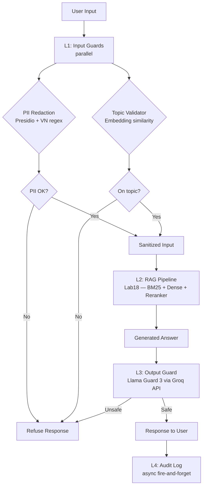

# Blueprint Document — Production RAG Evaluation & Guardrail System

Lab 24 · VinUniversity AICB Program · 05/2026

---

## Section 1: SLO Definition

| Metric | Target | Alert Threshold | Window | Severity |
|---|---|---|---|---|
| Faithfulness | ≥ 0.85 | < 0.80 | 30 phút | P2 |
| Answer Relevancy | ≥ 0.80 | < 0.75 | 30 phút | P2 |
| Context Precision | ≥ 0.70 | < 0.65 | 1 giờ | P3 |
| Context Recall | ≥ 0.75 | < 0.70 | 1 giờ | P3 |
| P95 Latency (full stack) | < 2.5s | > 3s | 5 phút | P1 |
| Guardrail Detection Rate | ≥ 90% | < 85% | 24 giờ | P2 |
| False Positive Rate | < 5% | > 10% | 24 giờ | P2 |

**Measurement cadence:** RAGAS continuous eval trên 1% traffic sample (≈ 1.000 queries/tháng với 100k volume).

---

## Section 2: Architecture Diagram

**Latency budget per layer:**

| Layer | Component | P95 Target |
|---|---|---|
| L1 | PII + Topic (parallel) | < 50ms |
| L2 | RAG — retrieval + LLM generation | < 2.0s |
| L3 | Llama Guard 3 (Groq API) | < 100ms |
| L4 | Audit log (async, không tính) | — |
| **Total** | **End-to-end** | **< 2.5s** |

---

## Section 3: Alert Playbook

### Incident 1: Faithfulness drops < 0.80

**Severity:** P2
**Detection:** RAGAS continuous eval alert (30-minute window)

**Likely causes:**
1. Retriever returning bad chunks → check Context Precision score cùng thời điểm
2. LLM prompt thay đổi hoặc model version update
3. Document corpus được update mà chưa re-index

**Investigation steps:**
1. Check CP score cùng timeframe — nếu CP cũng drop → retrieval issue
2. Check prompt version trong version control — diff vs tuần trước
3. Check document update log — có file mới được add không?
4. Check LLM API model version — OpenAI có auto-update không?

**Resolution:**
- Retrieval issue: re-run indexing pipeline, tăng `RERANK_TOP_K`
- Prompt drift: rollback prompt version
- Corpus issue: re-run Lab18 chunking + indexing
- Model issue: pin model version trong code (`model="gpt-4o-mini-2024-07-18"`)

**SLO impact:** TTD target < 30 phút, TTR target < 2 giờ

---

### Incident 2: P95 Latency > 3s

**Severity:** P1
**Detection:** Real-time latency monitoring (5-minute window)

**Likely causes:**
1. Qdrant slow response — disk I/O hoặc memory pressure
2. Groq API degraded — L3 latency spike
3. OpenAI API slow — L2 generation spike
4. L1 sequential processing thay vì parallel

**Investigation steps:**
1. Check layer breakdown trong audit log — xác định layer nào chậm
2. Check Qdrant server metrics — CPU/memory usage
3. Check Groq API status page — groq.com/status
4. Check OpenAI API latency — platform.openai.com/status
5. Verify async code chạy đúng — L1 có chạy parallel không?

**Resolution:**
- Qdrant issue: scale vertically, hoặc switch sang Qdrant Cloud
- L3 slow: cache Llama Guard results cho identical responses (30s TTL)
- L2 slow: reduce max_tokens, hoặc stream response
- Code issue: fix async/await, verify asyncio.gather cho parallel tasks

**SLO impact:** P1 — page on-call immediately, TTR target < 30 phút

---

### Incident 3: Guardrail Detection Rate < 85%

**Severity:** P2
**Detection:** Weekly adversarial test report

**Likely causes:**
1. New attack patterns không có trong test set
2. Topic Guard threshold quá thấp (0.6 → tăng lên 0.65)
3. Llama Guard model bị jailbreak bởi encoded attacks
4. PII patterns chưa cover hết các format mới

**Investigation steps:**
1. Review `adversarial_test_results.csv` — loại attack nào bị miss?
2. Check false negative patterns — có pattern mới (Unicode encode, multilingual)?
3. Test Llama Guard với safe/unsafe samples gần đây
4. Review VN_PII regex patterns — có format CCCD/phone mới không?

**Resolution:**
- Add new attack patterns vào adversarial test set
- Tune topic threshold từ 0.6 → 0.65
- Add Prompt Guard (Meta) như second layer injection classifier
- Update VN_PII regex patterns
- Re-run C.3 adversarial tests, verify detection ≥ 90%

**SLO impact:** TTD target < 24 giờ, TTR target < 1 tuần

---

## Section 4: Cost Analysis

### Monthly Cost Estimate (assumption: 100.000 queries/tháng)

| Component | Unit Cost | Volume | Monthly Cost |
|---|---|---|---|
| RAG generation (GPT-4o-mini) | $0.001/query | 100.000 | $100 |
| RAGAS continuous eval (1% sample) | $0.01/query | 1.000 | $10 |
| LLM Judge — pairwise T2 (gpt-4o-mini) | $0.001/query | 10.000 | $10 |
| LLM Judge — deep review T3 (gpt-4o) | $0.05/query | 500 | $25 |
| Presidio (self-hosted) | — | 100.000 | $0 |
| Llama Guard 3 (Groq free tier) | $0/query (capped) | 100.000 | $0* |
| OpenAI Embeddings (TopicGuard) | $0.0001/1K tokens | 100.000 | $5 |
| Qdrant Cloud (nếu không self-host) | $25/month | — | $25 |
| **Total** | | | **~$175** |

*Groq free tier: 14.400 requests/ngày = 432.000/tháng — đủ cho volume này.

### Cost optimization opportunities

1. **Tier judge:** chỉ dùng T3 (GPT-4) cho 0.5% sample thay vì 1% → save $25
2. **Cache Llama Guard:** identical responses trong 30s TTL → save ~20% L3 calls
3. **Groq paid tier:** nếu vượt free tier, Groq charged $0.20/1M tokens ≈ $20/month
4. **Self-host Qdrant:** tiết kiệm $25/month nếu có server
5. **Batch embedding:** gom TopicGuard embed calls → giảm API overhead

### Break-even vs no-guardrail

| Scenario | Monthly cost | Risk |
|---|---|---|
| No eval, no guardrail | $100 | High — blind production |
| Eval only (RAGAS) | $110 | Medium — no protection |
| Full stack (current) | $175 | Low — production-ready |
| Full stack + monitoring | $200 | Very low |

**Kết luận:** Chi thêm $75/tháng để có full guardrail stack là hợp lý. Một incident PII leak có thể tốn hàng triệu USD tiền phạt GDPR/Nghị định 13.
